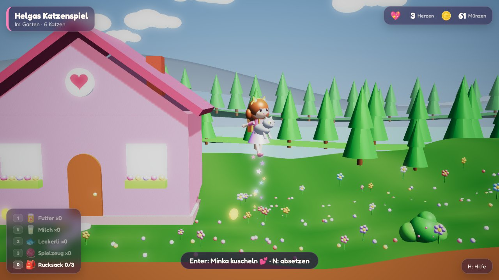
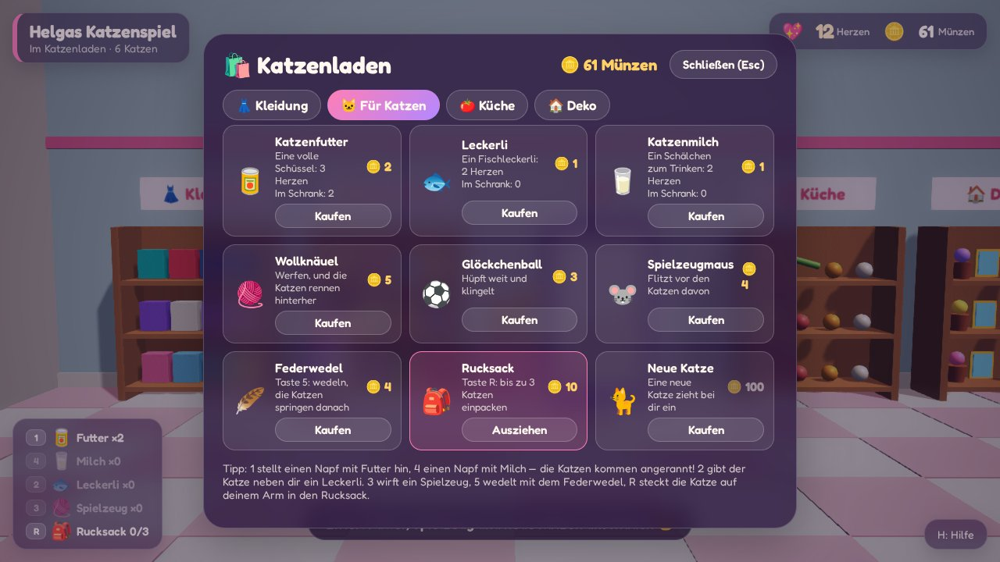
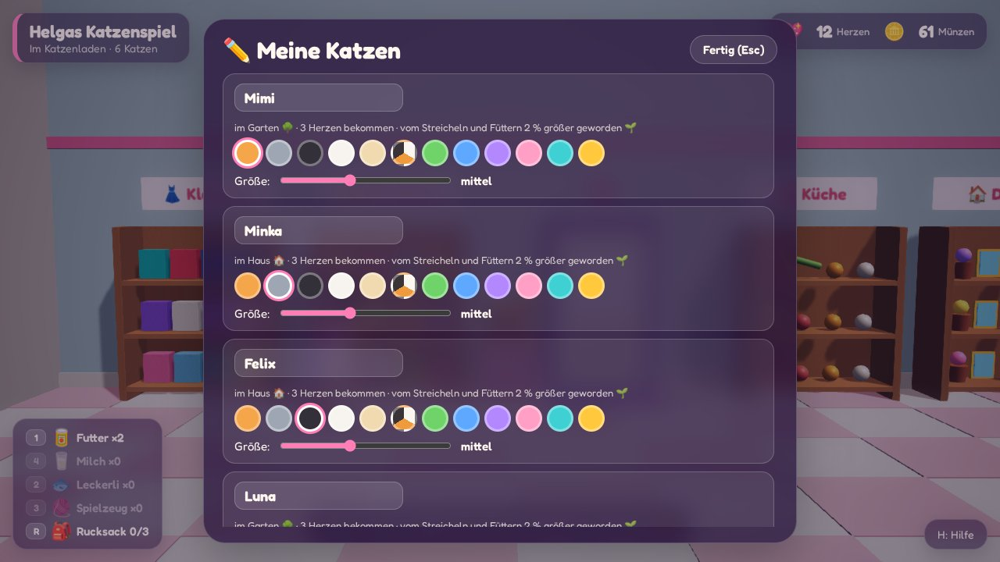
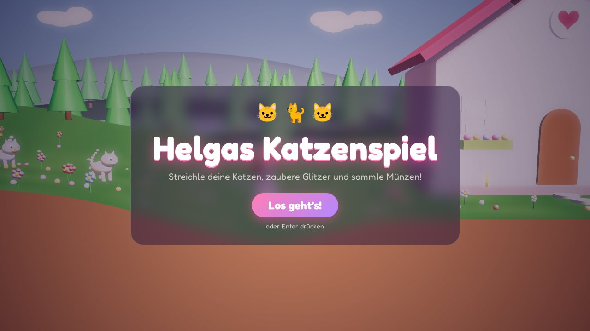

<!-- SPDX-FileCopyrightText: 2026 Marcel Petrick <mail@marcelpetrick.it> -->
<!-- SPDX-License-Identifier: GPL-3.0-or-later -->

# 🐱 Helgas Katzenspiel

[](https://github.com/marcelpetrick/HelgasKatzenspiel/actions/workflows/ci.yml)
[](https://github.com/marcelpetrick/HelgasKatzenspiel/actions/workflows/docker.yml)
[](https://github.com/marcelpetrick/HelgasKatzenspiel/releases/latest)
[](LICENSE)
[](vite.config.ts)
[](https://www.babylonjs.com/)
[](https://www.typescriptlang.org/)
[](https://vite.dev/)
[](https://vitest.dev/)
[](https://playwright.dev/)
[](https://nodejs.org/)

A cute, colourful 3D browser game about a little girl and her many cats. Pet them, feed them,
carry them around and fly with them, go to school for coins, go shopping, dress up and decorate the
house. No weapons, no fighting: just hearts. The game speaks German.

_Ein niedliches, buntes Browserspiel: Ein Mädchen streichelt und versorgt ganz viele Katzen, zaubert,
fliegt, geht zur Schule, verdient Münzen, kauft im Katzenladen ein und schmückt ihr Haus._

It is designed together with Helga, who decides what goes in; her wishes are collected in
[`visions.md`](visions.md). The look follows [Allium Assault](https://github.com/marcelpetrick/AlliumAssault).

**Author: Marcel Petrick <mail@marcelpetrick.it>** · **License: GPLv3 or later, see [`LICENSE`](LICENSE).**
**Note: this project is generated with AI.**

<p align="center">
  
</p>

<table>
  <tr>
    <td width="50%"></td>
    <td width="50%"></td>
  </tr>
  <tr>
    <td width="50%"></td>
    <td width="50%"></td>
  </tr>
  <tr>
    <td width="50%"></td>
    <td width="50%"></td>
  </tr>
  <tr>
    <td width="50%"></td>
    <td width="50%"></td>
  </tr>
</table>

## How to play

| Key       | Action                                                                                                  |
| --------- | ------------------------------------------------------------------------------------------------------- |
| ← →       | walk                                                                                                    |
| ↑ ↓       | walk further back / to the front; ↑ at a door goes through it                                           |
| Space     | jump; **hold** to fly, let go to float down                                                             |
| Enter     | pet the cat next to you, pick up a toy, or use what is in front of you (door, shelf, cupboard, stove …) |
| N         | pick up the nearest cat or put it down; you can fly with it                                             |
| R         | put the cat in your arms into the backpack (up to three), or take one out                               |
| 1 / 4     | put down a bowl of food / milk: the cats come running, eat in turn, and squabble                        |
| 2         | give the cat next to you a treat                                                                        |
| 3 / 5     | throw a toy (yarn ball, bell ball, toy mouse) / wave the feather wand                                   |
| Z (or Y)  | cast a spell: sparkles, and every cat nearby is delighted                                               |
| V         | hide-and-seek: the cats hide behind bushes; walk past a bush to find them                               |
| K         | open the shop menu from anywhere                                                                        |
| M / F     | "Meine Katzen" (name, colour, size) / "Meine Figur" (skin, hair, hairstyle, face)                       |
| S / T / H | save the game / sound on or off / hide or show the list of keys                                         |
| Esc       | close a menu                                                                                            |

The number keys and Enter on the number pad work too. The game saves itself every 15 seconds and when the page is closed, so each browser continues where it left off. Only one tab can play at a time: a second tab waits until the first is closed, then starts from its latest save. “🔄 Neues Spiel” in the key list starts over.

**The world.** A long garden with no fences: the school on the left, the girl's house and the cat
shop, a meadow, a wood with hiding bushes, and far to the right a beach with the sea, palm trees and
a sunshade. Walk up into a door to go in.

- **House:** kitchen (bowls, stove, table, cupboards), hall, bathroom and bedroom with the wardrobe.
  Everything bought in the shop is kept in the wardrobe.
- **Cat shop:** four shelves (clothes, cat things, kitchen things, decoration); Enter at a shelf opens
  that page of the shop. A cat keeps the till; a new cat bought here waits outside the door.
- **School:** five sums at one of three levels; the grade (1–6) earns up to 30 coins.

**Coins.** A happy cat drops a coin every three hearts; after 60 hearts every two, after 250 every
heart. Walk over a coin to collect it. In the house, coins also appear on the table, in the bowls, on
the tub, at the wardrobe and in the cupboards (faster the more the house is decorated). Emptying a
kitchen bowl leaves a coin in it; finding every cat at hide-and-seek pays two coins per cat.

**Cats.** Petting makes hearts. Food makes cats rounder, chasing toys slims them down again. Thrown
toys stay on the floor, and the cats play with them by themselves. A new cat costs 100 coins (at most
16 cats). With four or more cats, happy grown-ups have kittens, which grow up with every heart; grown
cats keep growing slowly when they are petted and fed, up to a quarter bigger.

**Dressing up.** Shirts, skirts and trousers, shoes, cat-ear headbands, bows, clips, earrings and nail
polish; eight hairstyles and many hair colours in the figure editor; a backpack for carrying cats.

**Cooking.** Buy groceries (tomato, leek, egg, bread, cheese, apple, milk, cocoa, oranges), a pan, a
pot and cutlery. At the stove, cook a fried egg, an omelette, leek soup, tomato salad, a cheese
sandwich or apple slices, or make hot cocoa or orange juice. Eat or drink it at the table, and for a
minute the girl can fly twice as high.

**Sound.** Every action has a small synthesized sound (meows, purrs, a squabbling hiss, coin plings,
sparkles, a doorbell, a shop bell), made with the Web Audio API, no sound files.

## Setup

Requires Node.js 24.

```sh
npm install
npm run dev        # http://localhost:5273
```

`npm run build` writes a static site to `dist/`; `npm run preview` serves it on port 4273. Both ports
are fixed in [`vite.config.ts`](vite.config.ts); if one is taken, Vite stops instead of picking another.

## Docker

The image builds the game with Node 24 and serves the static files with nginx.

```sh
docker build -t helgas-katzenspiel .
docker run --rm -p 8080:80 helgas-katzenspiel      # open http://localhost:8080
```

After a successful GitHub release, the workflow publishes
`ghcr.io/marcelpetrick/helgas-katzenspiel:<version>` and updates `:latest` for the newest release.
The image job runs separately, so an image can appear later than the web package or fail to publish;
check the Release workflow and rerun its failed image job if needed. The package is private like the
repository: `docker login ghcr.io` with a token that has `read:packages` before pulling.

## Releases

Pushing a tag `vX.Y.Z` on `main`, newer than all published releases and matching `package.json`, runs
the whole pipeline and publishes a GitHub release with the zipped static site
(`helgas-katzenspiel-X.Y.Z-web.zip` plus its SHA-256). Unzip it and serve the folder with any static
web server. The Docker image follows in a separate job; the Release workflow shows whether both jobs
have succeeded.

## Testing and the pipeline

```sh
./localPipeline.sh           # everything; must be green before every commit
./localPipeline.sh --no-e2e  # skip the browser tests
```

| Stage     | What it checks                                                       |
| --------- | -------------------------------------------------------------------- |
| install   | `npm ci` when `node_modules` does not match `package-lock.json`      |
| eslint    | type-aware `typescript-eslint` strict rules                          |
| prettier  | formatting                                                           |
| stylelint | CSS                                                                  |
| markdown  | markdownlint                                                         |
| typecheck | `tsc --noEmit`, strict                                               |
| coverage  | Vitest unit tests of the game rules in `src/core`, ≥ 95 % enforced   |
| build     | Vite production build                                                |
| e2e       | Playwright in headless Chromium (locally also Firefox and two tabs)  |
| docker    | builds the image and checks it serves the game (`--no-docker` skips) |

GitHub Actions runs the same script: [`ci.yml`](.github/workflows/ci.yml) on every push,
[`docker.yml`](.github/workflows/docker.yml) builds and checks the image, and
[`release.yml`](.github/workflows/release.yml) makes releases from tags and then publishes the image.

Single steps: `npm test`, `npm run coverage`, `npm run lint`, `npm run typecheck`, `npm run e2e`,
`npm run format` (auto-fix formatting).

## Scripts

| Script                                                              | Purpose                                                            |
| ------------------------------------------------------------------- | ------------------------------------------------------------------ |
| [`localPipeline.sh`](localPipeline.sh)                              | the quality gate above; `--help` lists the stages                  |
| [`scripts/docker-check.sh`](scripts/docker-check.sh) `[tag]`        | builds the image, starts it on a free port, checks page and bundle |
| [`scripts/screenshot.mjs`](scripts/screenshot.mjs) `[url] [outDir]` | retakes the README screenshots from a running game                 |

## Project layout

```text
src/core/    game rules without Babylon or the DOM (unit tested): world layout, cats, shop,
             school, kitchen, the girl's look, saving
src/render/  Babylon.js scene: garden, house and shop interiors, school, girl, cats, props, effects
src/ui/      HUD, title screen, menus (shop, cats, figure, school, cooking), German texts, storage
src/audio.ts synthesized sound effects
src/app.ts   keyboard, game loop, wires everything together
e2e/         Playwright browser tests
tests/       Vitest unit tests
```

## Versioning

Semantic versioning in `package.json`: every commit bumps the patch version, new features bump the
minor version. Commits follow [Conventional Commits](https://www.conventionalcommits.org/).

## License

Copyright © 2026 Marcel Petrick. Licensed under the GNU General Public License v3.0 or later — see
[`LICENSE`](LICENSE).
